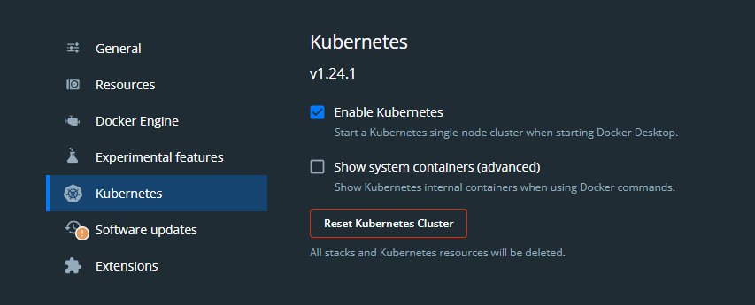

# Trading Journal Authentication

## Change Log

### 1.0.0

Fully functional authentication with JWT generation and interpretation made in this project code

### 1.1.0

Fully functional authentication with JWT library

## Pending for the future
* Manage user session
  * Can cancel a user session forcing a new login
  * Cache the session status somehow
    * Update this cache during login with time equal to jwt expiration
    * Evict this cache when delete user session
  * JWT lib will have a new version to validate JWT against some API
    * Use configuration for that
    * The API must receive the JWT and check if session is still valid
* * One way ssl or Two way ssl: https://dzone.com/articles/hakky54mutual-tls-1

## Swagger

[http://localhost:8080/swagger-ui/index.htm](http://localhost:8080/swagger-ui/index.html)
Or just [http://localhost:8080](http://localhost:8080)

## Running

### Locally

Set the active profile as local:

```bash
-Dspring.active.profiles=local
```

### Environment Variables

Default application properties used on deployed/container run require a set of Environment Variables:

* Generic
  * **PORT**: default is 8080
  * **ENVIRONMENT**: Environment name, mostly used for logging in logback file, default is DEFAULT
* Email
  * **EMAIL_HOST**: email host address 
  * **EMAIL_PASSWORD**: password to connect SMTP server
  * **EMAIL_USERNAME**: username to connect SMTP server
  * **EMAIL_PORT**: SMTP port
* Database
  * **DATASOURCE_URL**: datasource/server location url with database name
  * **DATASOURCE_USERNAME**: Username to connect database (read and write)
  * **DATASOURCE_PASSWORD**: Password of the username to connect database
* Reference for email links
  * **WEB_APP_URL**: Web app url where email links will be redirected to
  * **VERIFICATION_PATH**: Users verification page where email links will be redirected to, default is _auth/email-verified_
  * **CHANGE_PASSWORD_PAGE**: Change password page where email links will be redirected to, default is _auth/change-password_
* Properties using during application startup and first run
  * **ADMIN_EMAIL**: Email of application admin, this user will be created at the first run if there is no other ADMIN available
* JWT Properties
  * **JWT_PRIVATE_KEY**: Private key file used to sign access tokens
  * **JWT_PUBLIC_KEY**: public key file based on private key used to read access tokens
  * **JWT_ACCESS_TOKEN_EXPIRATION**: time to expire access token, default is 3600 seconds
  * **JWT_REFRESH_TOKEN_EXPIRATION**: time to expire refresh token, default is 86400 seconds
  * **JWT_ISSUER**: Access token issuer
  * **JWT_AUDIENCE**: Access token audience

### Container Dependencies

#### Postgres

```bash
docker run -d --name postgres -e POSTGRES_PASSWORD=trade-journal -e POSTGRES_USER=trade-journal -e POSTGRES_DB=trade-journal -p 5432:5432 postgres
```

### Keys Dependencies

```bash
# Generate a secret
openssl genrsa -out secret_key.pem 2048
# Transform the secret into a private key, to sign the jwt token
openssl pkcs8 -topk8 -inform PEM -outform PEM -in secret_key.pem -out private_key.pem -nocrypt
# Generate a public key from the secret to verify the jwt token
openssl rsa -in secret_key.pem -pubout -outform PEM -out public_key.pem
```

### Database Schema

```
CREATE TABLE Tenancy (
  id SERIAL NOT NULL,
  name VARCHAR(254) NOT NULL,
  userLimit int NOT NULL DEFAULT 1,
  userUsage int NOT NULL DEFAULT 0,
  enabled BOOLEAN NOT NULL DEFAULT TRUE,
  PRIMARY KEY (id),
  UNIQUE(name)
);

CREATE TABLE Users (
  id SERIAL NOT NULL,
  tenancyId int NULL,
  userName VARCHAR(45) NOT NULL,
  password VARCHAR(2000) NOT NULL,
  firstName VARCHAR(45) NOT NULL,
  lastName VARCHAR(45) NOT NULL,
  email VARCHAR(150) NOT NULL,
  enabled BOOLEAN NOT NULL,
  verified BOOLEAN NOT NULL,
  createdAt TIMESTAMP NOT NULL,
  PRIMARY KEY (id),
  CONSTRAINT tenancyIdFk FOREIGN KEY (tenancyId) REFERENCES Tenancy (id)
);

CREATE TABLE Authorities (
  id SERIAL NOT NULL,
  category VARCHAR(50) NOT NULL,
  name VARCHAR(45) NOT NULL,
  PRIMARY KEY (id),
  UNIQUE(name)
);

CREATE TABLE UserAuthorities (
  id SERIAL NOT NULL,
  userId int NOT NULL,
  authorityId int NOT NULL,
  PRIMARY KEY (id),
  CONSTRAINT authorityIdFk FOREIGN KEY (authorityId) REFERENCES Authorities (id) ON DELETE CASCADE,
  CONSTRAINT userIdFk FOREIGN KEY (userId) REFERENCES Users (id) ON DELETE CASCADE
);

CREATE TABLE Verifications (
  id SERIAL NOT NULL,
  email VARCHAR(150) NOT NULL,
  type VARCHAR(45) NOT NULL,
  status VARCHAR(45) NOT NULL,
  hash VARCHAR(2000) NOT NULL,
  lastChange TIMESTAMP NOT NULL,
  PRIMARY KEY (id)
);
```

### Database initial data

```
INSERT INTO Authorities (category, name) VALUES ('COMMON_USER','ROLE_USER');
INSERT INTO Authorities (category, name) VALUES ('ADMINISTRATOR','ROLE_ADMIN');
INSERT INTO Authorities (category, name) VALUES ('ORGANISATION','TENANCY_ADMIN');
```

## Docker

### Build Locally or for Pipeline test

This docker file copies the sample private and public keys in **/src/main/resources/** to the image, so you can refer each keys from **/etc/ssl/certs/private_key.pem** and **/etc/ssl/certs/public.pem**

```docker build -t allanweber/trading-journal-authentication:1.0.0 -f docker/DockerfileTest .```

### Build for deployment

For this option, you must provide your own private and public keys, add it to the image and configure the proper environment variables to read those files

```docker build -t allanweber/trading-journal-authentication:1.0.0 -f docker/Dockerfile .```

Tag your image to latest: ```docker tag allanweber/trading-journal-authentication:1.0.0 allanweber/trading-journal-authentication:latest``` 

Push image to registry: ```docker push allanweber/trading-journal-authentication:latest```

### Run it with env variables

* Get postgres container ip: ```docker inspect -f '{{range .NetworkSettings.Networks}}{{.IPAddress}}{{end}}' CONTAINER_ID```

```bash
docker run -p 8080:8080 --name trading-journal-authentication \
-e ADMIN_EMAIL= \
-e DATASOURCE_URL= \
-e DATASOURCE_PASSWORD= \
-e DATASOURCE_USERNAME= \
-e EMAIL_HOST= \
-e EMAIL_PORT= \
-e EMAIL_USERNAME= \
-e EMAIL_PASSWORD= \
-e JWT_ACCESS_TOKEN_EXPIRATION= \
-e JWT_REFRESH_TOKEN_EXPIRATION= \
-e JWT_AUDIENCE= \
-e JWT_ISSUER= \
-e JWT_PRIVATE_KEY= \
-e JWT_PUBLIC_KEY= \
-e WEB_APP_URL= \
allanweber/trading-journal-authentication:VERSION
```

## Kubernetes

### Enable Kubernetes on local Docker



The scripts for Kubernetes are inside the folder **k8s**, remember to change the names, labels etc. as you like.

Also, remember to replace where you find placeholders for you own values, such as _<SECRET>_, for example

### Create a namespace

This step is not required, if you do not want a namespace, change all other files where the namespace is referred.

Create namespace: ```kubectl apply -f k8s/namespace.yml```

Check namespace created: ```kubectl get namespace```

### Config Maps

Create config map: ```kubectl apply -f k8s/config-maps.yml```

Get config map: ```kubectl get cm -n trading-journal trading-journal-authentication-prd -o yaml```

Delete config map: ```kubectl delete cm -n trading-journal trading-journal-authentication-prd```

### Secrets

Create the secrets: ```kubectl apply -f  k8s/secrets.yml```

Check created secrets: ```kubectl get secret -n trading-journal trading-journal-authentication-prd -o yaml```

Delete secrets if you like: ```kubectl delete secrets -n trading-journal trading-journal-authentication-prd```

### Public and Private Keys

Change the <FILE_LOCATION> placeholder with the location of your private and public **.pem**

Run the command: ```./k8s/import-keys.sh```

Get Keys

```kubectl get cm -n trading-journal trading-journal-private-key -o yaml```

```kubectl get cm -n trading-journal trading-journal-public-key -o yaml```

Delete secrets if you like

```kubectl cm secrets -n trading-journal trading-journal-private-key```

```kubectl cm secrets -n trading-journal trading-journal-public-key```

### Deployment

Create deployment: ```kubectl apply -f ./k8s/deployment.yml```

Check deployment: ```kubectl logs -n trading-journal deployment/trading-journal-authentication```

Get deployment: ```kubectl get deploy -n trading-journal```

Delete deployment: ```kubectl delete deploy -n trading-journal trading-journal-authentication```

Get pods: ```kubectl get pods -n trading-journal```

Describe pods: ```kubectl describe pod -n trading-journal trading-journal-authentication```

Set a variable with pod generated name: ```POD=$(kubectl get pod -n trading-journal -l app=trading-journal-authentication -o jsonpath="{.items[0].metadata.name}")```

## Deploys

### Create completely new

```kubectl apply -f k8s/namespace.yml```

```kubectl apply -f  k8s/secrets.yml```

```./k8s/import-keys.sh```

```kubectl apply -f k8s/config-maps.yml```

```kubectl apply -f ./k8s/deployment.yml```

```kubectl logs -n trading-journal deployment/trading-journal-authentication```

### Delete all (except namespace)

```kubectl delete deploy -n trading-journal trading-journal-authentication```

```kubectl delete cm -n trading-journal trading-journal-authentication-prd```

```kubectl cm secrets -n trading-journal trading-journal-private-key```

```kubectl cm secrets -n trading-journal trading-journal-public-key```

```kubectl delete secrets -n trading-journal trading-journal-authentication-prd```

## Access application

### From local to trading-journal-authentication

```kubectl port-forward  -n trading-journal $POD 8080```

## Configurations

### Start up application the first time
* **journal.authentication.admin-user.email**: email of the application admin, this will be used to generate a nre Admin user, and send the confirmations like user registration, change password etc.

### Verifications
In case there is need for new users confirm their emails, then enable the configuration property:

* **journal.authentication.verification.enabled** *e.g. true*
* **journal.authentication.hosts.front-end** *e.g. http://localhost:8080* to be able to proper redirect the user to the page of confirm registration or change password
* **journal.authentication.hosts.verification-page** *e.g. auth/email-verified* the web page user will be redirected to confirm the email
* **journal.authentication.hosts.change-password-page** *e.g. auth/change-password* the web page user will be redirected to change password

## Metrics

* http://localhost:8080/metrics/signup_user - Amount of time create a new user via signup
* http://localhost:8080/metrics/signin_use - Amount of time to authenticate a user
* http://localhost:8080/metrics/refresh_token - Amount of time to refresh the user token
* http://localhost:8080/metrics/verify_new_user - Amount of time to verify a new user emails
* http://localhost:8080/metrics/send_new_verification - Amount of time to send a new email verification to the user email
* http://localhost:8080/metrics/request_password_change - Amount of time to request a password change
* http://localhost:8080/metrics/password_change - Amount of time to apply a password change
* http://localhost:8080/metrics/get_me_info - Amount of time to retrieve user information